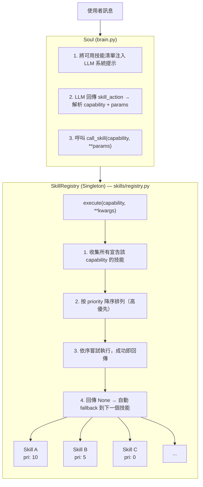
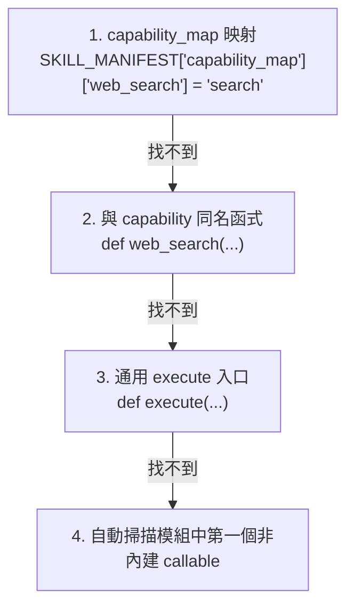
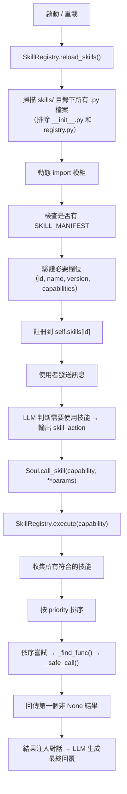

# Soveranima

> [!Warning]
> **警告:**
> `Soveranima`會自動演化及自動使用 **skills** 如果您使用了含有惡意功能的 **skill** 或是 **Prompt** 所產生的違法行爲請自行負責
> **Soveranima可能會出錯**

## Soveranima 簡介
- 透過使用者自訂時間自動調用 `API` 思考是否與使用者互動
- 可透過添加 `skills` 激發 `Soveranima` 淺能
- 透過與使用者的互動自動演化成長
- 主動關心使用者、提醒使用者

## 安裝與部署

```bash
pip install -r requirements.txt
pm2 start main.py --name Soveranima --interpreter python3
```

> [!Note]
> Discord Developer Portal 中需開啟 **Message Content Intent**

## 核心功能

- **記憶系統** — 對話記錄、生活日誌、事實清單，跨對話持久保存於 SQLite
- **心跳機制** — 定時主動關心使用者，支援 DND 靜音時段自動提升發言門檻
- **自我演化** — AI 可主動提出程式碼升級請求，Owner 透過 `/approve` 審核後自動套用並重啟
- **SSP 技能系統** — 插件式技能架構，支援熱插拔，詳見下方 SSP 章節

## `.env` 基本設定

```conf
BOT_TOKEN=[Discord 機器人 TOKEN](必填)
OPENAI_API_KEY=[API 端點密鑰](必填)
OPENAI_BASE_URL=[API 端點 URL](必填)
OPENAI_MODEL=[API 調用之模型](必填)
OWNER_ID=[Soveranima 默認擁有者之Discord 使用者 ID](可選，未填寫無法授權 Soveranima 升級)
```

## `Discord` 指令說明

`/help` 顯示可用指令說明

`/config` 開啟設定選單

`/status` 查看機器人狀態與記憶統計

`/todo` 查看待審核的升級請求（僅限 OWNER）

`/approve` 批准升級請求（僅限 OWNER）

`/reject` 拒絕升級請求（僅限 OWNER）

`/detail` 查看升級請求詳情（僅限 OWNER）

`/forget` 清除對話記憶

## `Skills` SSP 架構（Soveranima Skill Protocol）

SSP 是 Soveranima 的技能插件協議。開發者只需在 `skills/` 目錄下放入一個 `.py` 檔案，並遵循以下規範，即可讓 Soveranima 自動載入並使用你的技能。

---

### 架構總覽



---

### 函式解析順序

當 Registry 需要在技能模組中找到對應 capability 的函式時，依以下順序查找：



---

### SKILL_MANIFEST 規格

每個技能模組必須在模組頂層匯出一個 `SKILL_MANIFEST` 字典：

```python
SKILL_MANIFEST = {
    # ── 必要欄位 ──────────────────────────────────────
    "id":           str,   # 唯一識別碼（如 "my_weather_skill"）
    "name":         str,   # 顯示名稱（如 "天氣查詢"）
    "version":      str,   # 語意化版本（如 "1.0.0"）
    "capabilities": list,  # 至少一項能力字串（如 ["web_search"]）

    # ── 選填欄位 ──────────────────────────────────────
    "description":    str,   # 技能描述（會顯示給 LLM 參考）
    "priority":       int,   # 同 capability 的執行優先序（預設 0，越高越優先）
    "author":         str,   # 作者名稱
    "capability_map": dict,  # 能力名稱 → 函式名稱的映射
}
```

---

### Capability 機制

Capability 名稱完全自由定義，不需要預先註冊。系統會在每次呼叫時動態掃描 `skills/` 目錄，自動偵測新增、刪除、修改的技能檔案並即時重載（熱插拔），將所有技能的 Manifest 注入 LLM 提示中，LLM 會自行判斷何時使用哪個 capability。

---

### 開發者指南：建立你的第一個 Skill

#### Step 1：建立檔案

在 `skills/` 目錄下建立 `my_skill.py`：

```python
# skills/my_skill.py

SKILL_MANIFEST = {
    "id": "my_awesome_skill",
    "name": "我的技能",
    "description": "這個技能可以做某件很酷的事。",
    "version": "1.0.0",
    "capabilities": ["my_capability"],
    "priority": 5,
    "author": "YourName",
}

def my_capability(query, **kwargs):
    """函式名稱與 capability 同名，Registry 會自動找到。"""
    # kwargs 可能包含系統注入的 api_key, base_url
    api_key = kwargs.get("api_key")

    try:
        result = do_something(query)
        return result       # 回傳字串結果
    except Exception:
        return None          # 回傳 None → 觸發 fallback 到下一個技能
```

#### Step 2：把檔案放入skills資料夾

把檔案放進 `skills/` 目錄，系統會在下次呼叫時自動偵測並載入，不需要重啟。

---

### 完整範例：翻譯技能

```python
# skills/translator.py

SKILL_MANIFEST = {
    "id": "translator_deepl",
    "name": "DeepL 翻譯器",
    "description": "使用 DeepL API 進行高品質多語言翻譯。",
    "version": "1.0.0",
    "capabilities": ["translate"],
    "priority": 10,
    "author": "Developer",
    "capability_map": {
        "translate": "translate_text"    # 明確指定函式名稱
    }
}

import os

def translate_text(query, target_lang="ZH", **kwargs):
    """翻譯文字到目標語言"""
    try:
        import deepl
        auth_key = os.environ.get("DEEPL_API_KEY")
        if not auth_key:
            return None  # 無 key → fallback

        translator = deepl.Translator(auth_key)
        result = translator.translate_text(query, target_lang=target_lang)
        return f"翻譯結果：{result.text}"
    except ImportError:
        print("⚠️ 缺少 deepl 套件，請執行 pip install deepl")
        return None
    except Exception as e:
        print(f"❌ 翻譯失敗: {e}")
        return None
```

---

### 開發注意事項

| 規則 | 說明 |
|------|------|
| **回傳 `None` = 失敗** | Registry 會自動嘗試下一個同 capability 的技能 |
| **接受 `**kwargs`** | 系統會自動注入 `api_key`、`base_url` 等參數，用 `**kwargs` 接收可避免 TypeError |
| **選用依賴用 try/except** | 將非必要的 import 包在 try/except 中，缺少套件時優雅降級 |
| **不需要繼承任何 class** | 純粹基於 `SKILL_MANIFEST` 字典 + 函式的約定式設計 |
| **id 必須唯一** | 重複的 id 會導致後載入的技能覆蓋先前的 |
| **priority 越高越優先** | 同 capability 下 priority 高的先執行，失敗才輪到低的 |
| **檔名不影響功能** | 但建議用有意義的名稱方便管理 |

---

### 技能生命週期



---

## 授權

本專案採用 [GNU General Public License v3.0](LICENSE) 授權。
